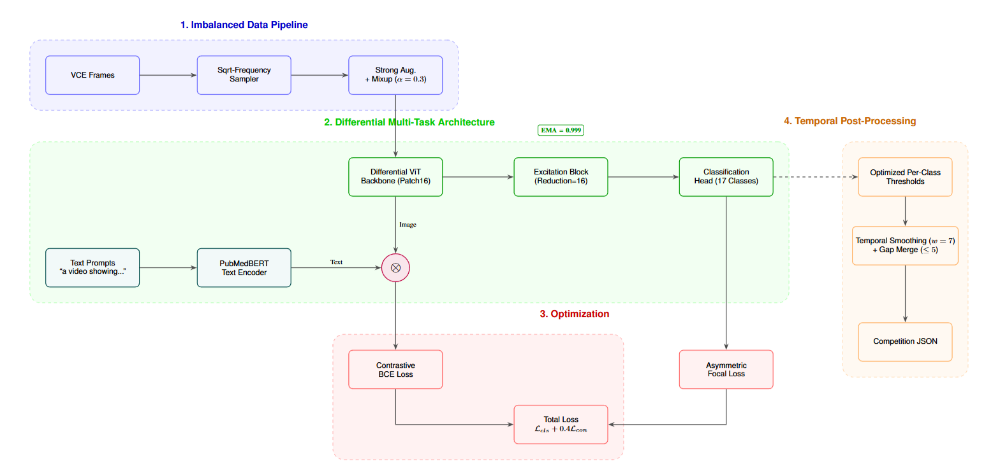

# Differential BiomedCLIP for ICPR 2026 RARE-VISION Challenge

> **Differential Attention-Augmented BiomedCLIP with Asymmetric Focal Optimization for Imbalanced Multi-Label Video Capsule Endoscopy Classification**

[](https://github.com/Palak-Handa/ICPR2026-RARE-VISION-Competition)
[](https://python.org)
[](https://pytorch.org)
[](#license)

---

## Overview

This repository contains our submission for the **ICPR 2026 RARE-VISION Competition**: Robust AI for Rare Events in Video Capsule Endoscopy (VCE). The task requires multi-label classification of 17 anatomical and pathological labels across sequential VCE video frames, with a focus on handling extreme class imbalance (positive ratios as low as 1:3,000 for rare pathologies).

### Key Results

| Metric | Score |
|--------|-------|
| **Overall mAP@0.5** | **0.2456** |
| **Overall mAP@0.95** | **0.2353** |
| Total inference time (3 videos, 161K frames) | 8.6 minutes |

### Per-Video Breakdown

| Video ID | Frames | mAP@0.5 | mAP@0.95 |
|----------|--------|---------|----------|
| ukdd_navi_00051 | 44,878 | 0.2371 | 0.2353 |
| ukdd_navi_00068 | 53,220 | 0.1808 | 0.1765 |
| ukdd_navi_00076 | 62,927 | 0.3189 | 0.2941 |

---

## Architecture



The pipeline consists of four stages:

1. **Imbalanced Data Pipeline**: Sqrt-frequency weighted sampling + strong augmentation + mixup (α=0.3)
2. **Differential Multi-Task Architecture**: BiomedCLIP ViT-B/16 with all 12 attention blocks replaced by differential attention, preserving pretrained weights. Dual-path: Excitation Block → classification head + PubMedBERT contrastive alignment
3. **Optimization**: Asymmetric Focal Loss (γ⁻=4) + Contrastive BCE, combined as L_cls + 0.4·L_con
4. **Temporal Post-Processing**: Per-class optimized thresholds → median smoothing (w=7) → gap merge (≤5 frames) → competition JSON

### Differential Attention

Standard multi-head self-attention is replaced with differential attention ([Ye et al., 2024](https://arxiv.org/abs/2410.05258)):

```
DiffAttn(X) = [softmax(Q₁K₁ᵀ/√d) - λ·softmax(Q₂K₂ᵀ/√d)] V
```

This cancels common-mode attention noise, amplifying signal from diagnostically meaningful spatial regions in endoscopic imagery.

---

## Repository Structure

```
.
├── README.md                          # This file
├── requirements.txt                   # Python dependencies
├── rare_vision_pipeline_v3_1.py       # Complete training + inference pipeline
├── configs/
│   └── default_config.yaml            # Hyperparameter configuration
├── scripts/
│   ├── train.sh                       # Training launch script
│   └── test.sh                        # Test inference launch script
├── utils/
│   └── make_json.py                   # Frame predictions → competition JSON
├── checkpoints/
│   └── README.md                      # Instructions for checkpoint files
├── results/
│   ├── test_predictions.json          # Competition submission JSON
│   └── test_predictions.xlsx          # Competition submission Excel
├── logs/
│   └── training_curves.png            # Loss / mAP / LR curves
├── curves/
│   ├── val_final_opt_pr.png           # Precision-Recall curves (17 classes)
│   ├── val_final_opt_roc.png          # ROC curves (17 classes)
│   └── val_final_opt_metrics.csv      # Per-class metrics table
├── assets/
│   └── architecture_diagram.png       # Pipeline architecture figure
└── report/
    ├── report.tex                     # Competition report (LaTeX)
    └── sample.bib                     # References
```

---

## Setup

### Requirements

- Python ≥ 3.10
- PyTorch ≥ 2.0 with CUDA
- GPU with ≥ 16 GB VRAM (tested on NVIDIA RTX PRO 6000, 102 GB)

### Installation

```bash
git clone https://github.com/<YOUR_USERNAME>/<REPO_NAME>.git
cd <REPO_NAME>

# Create virtual environment
python -m venv .venv
source .venv/bin/activate

# Install dependencies
pip install -r requirements.txt
```

### Dataset

The Galar dataset must be downloaded from [Figshare](https://plus.figshare.com/articles/dataset/Galar_-_a_large_multi-label_video_capsule_endoscopy_dataset/25304616) as per competition rules. Update the paths in `Config` class within `rare_vision_pipeline_v3_1.py`:

```python
Config.DATASET_ROOT = "/path/to/Galar_Dataset"
Config.TEST_DATA_ROOT = "/path/to/Testdata_ICPR_2026_RARE_Challenge"
```

---

## Usage

### Training

```bash
# Edit Config.MODE = "train" in rare_vision_pipeline_v3_1.py, then:
python rare_vision_pipeline_v3_1.py
```

Or use the shell script:
```bash
bash scripts/train.sh
```

**Training configuration (as used for submission):**

| Parameter | Value |
|-----------|-------|
| Epochs | 5 |
| Batch size | 128 |
| Learning rate (head) | 3×10⁻⁴ |
| Learning rate (backbone) | 9×10⁻⁵ |
| Weight decay | 5×10⁻⁴ |
| Scheduler | OneCycleLR (pct_start=0.15) |
| Label smoothing | 0.05 |
| Mixup α | 0.3 |
| EMA decay | 0.999 |
| Dropout | 0.4 |
| Focal γ⁺ / γ⁻ | 1 / 4 |
| Contrastive weight | 0.4 |
| Seed | 42 |

### Resume Training

To continue training from a checkpoint (e.g., extend from 5 to 10 epochs):

```python
Config.RESUME_FROM = "./checkpoints/best_model.pth"
Config.EPOCHS = 10  # New total (not additional)
Config.MODE = "train"
```

### Test Inference

```bash
# Edit Config.MODE = "test" in rare_vision_pipeline_v3_1.py, then:
python rare_vision_pipeline_v3_1.py
```

This loads the best checkpoint, applies EMA weights and optimized per-class thresholds, runs inference on all test videos, and generates both `test_predictions.json` and `test_predictions.xlsx`.

### Smoke Test (Debug Mode)

```bash
# Edit Config.MODE = "smoke" — uses 2 videos, 2 epochs, batch size 4
python rare_vision_pipeline_v3_1.py
```

---

## Training Logs

### Loss Curves

Training loss decreased monotonically from 0.488 to 0.176 over 5 epochs. Validation loss rose moderately from 0.203 to 0.411 (ratio ~2.3×), indicating controlled overfitting.

| Epoch | Train Loss | Val Loss | Val mAP | LR |
|-------|-----------|----------|---------|-----|
| 1 | 0.4884 | 0.2027 | 0.2347 | 8.92e-05 |
| 2 | 0.2842 | 0.3071 | 0.2385 | 7.21e-05 |
| 3 | 0.2316 | 0.3562 | 0.2444 | 4.09e-05 |
| **4** | **0.1920** | **0.3990** | **0.2528** | **1.18e-05** |
| 5 | 0.1762 | 0.4107 | 0.2482 | 9.00e-08 |

### Per-Class Optimized Thresholds

| Label | Threshold | Label | Threshold |
|-------|-----------|-------|-----------|
| mouth | 0.27 | active bleeding | 0.13 |
| esophagus | 0.55 | angiectasia | 0.83 |
| stomach | 0.69 | blood | 0.83 |
| small intestine | 0.77 | erosion | 0.57 |
| colon | 0.43 | erythema | 0.19 |
| z-line | 0.20 | hematin | 0.07 |
| pylorus | 0.49 | lymphangioectasis | 0.25 |
| ileocecal valve | 0.51 | polyp | 0.15 |
| | | ulcer | 0.50 |

---

## Class Imbalance Strategy

The Galar dataset exhibits extreme imbalance (up to 1:3,000 positive-to-negative ratio). Our multi-level approach:

1. **Sqrt-frequency sampling**: Frames weighted by 1/√(frequency of rarest active label)
2. **Asymmetric Focal Loss**: γ⁻=4 aggressively down-weights easy negatives
3. **Class-weighted contrastive loss**: Positive weights clipped to [1, 100]
4. **Mixup augmentation**: Interpolates images+labels (α=0.3), acts as regularizer
5. **Strong augmentation**: RandomResizedCrop, ColorJitter, flips, rotation, RandomErasing
6. **Label smoothing**: Softens targets to [0.05, 0.95]
7. **Per-class threshold optimization**: Searches from t=0.05 for rare classes (support < 1%)

---

## Reproducibility

- **Seed**: 42 (all random generators)
- **Hardware**: NVIDIA RTX PRO 6000 Blackwell Max-Q (102 GB VRAM)
- **Training time**: ~3 hours (5 epochs)
- **Inference time**: ~8.6 minutes (161K frames across 3 test videos)
- **Pretrained model**: BiomedCLIP (microsoft/BiomedCLIP-PubMedBERT_256-vit_base_patch16_224) from HuggingFace Hub

---

## Citation

If you use this work, please cite the competition and dataset:
```bibtex
@article{Lawniczak2025,
  author={Lawniczak, Anni and Dhir, Manas and Le Floch, Maxime and Handa, Palak and Koulaouzidis, Anastasios},
  title={{ICPR 2026 RARE-VISION Competition Document and Flyer}},
  year={2025},
  doi={10.6084/m9.figshare.30884858.v3}
}

@article{LeFloch2025galar,
  author={Le Floch, Maxime and others},
  title={Galar---a large multi-label video capsule endoscopy dataset},
  journal={Scientific Data},
  volume={12}, number={1}, pages={828},
  year={2025}
}
```

---

## License

This code is released for **research purposes only** in compliance with the ICPR 2026 RARE-VISION Competition rules. The Galar dataset is subject to its own licensing terms as described in [Le Floch et al., 2025]. Commercial use is strictly prohibited.

---

## Acknowledgments

We acknowledge the ICPR 2026 RARE-VISION Competition organizers for providing the platform and dataset. We thank Prof. Anastasios Koulaouzidis for sponsoring the event and the i-CARE group for their support.
